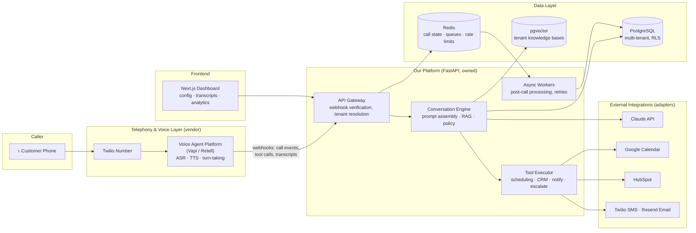
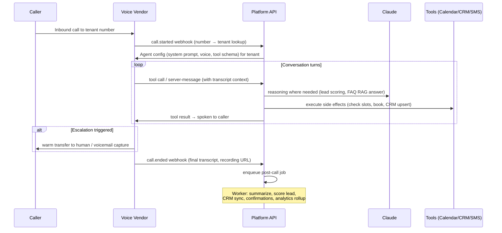
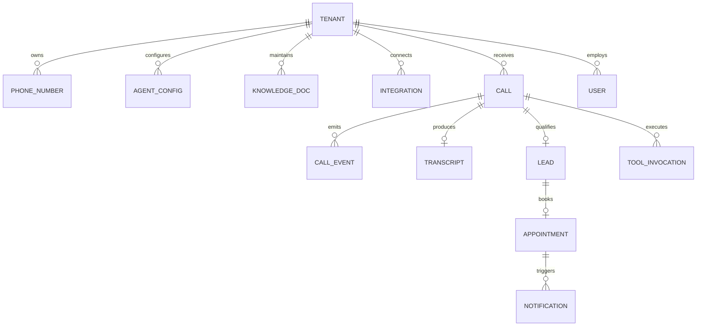

# AI Receptionist Platform — Phase 1: Requirements & Architecture

**Status:** Draft for product-owner approval
**Phase:** 1 of 8 (Requirements → Architecture → Folder Structure → Technology → Risks → Milestones)
**Rule:** No implementation begins until this document is approved.

---

## 1. Product Definition

A multi-tenant, voice-first AI Receptionist platform. Each tenant (a business) gets a phone
number. When customers call, an AI agent answers, converses naturally, answers FAQs from the
business's knowledge base, qualifies leads, books appointments, updates the CRM, sends
email/SMS confirmations, escalates to humans when needed, and logs everything for analytics.

**The core product thesis:** businesses are onboarded through *configuration* (prompts,
knowledge base, calendars, escalation rules, integrations), never through custom code.

---

## 2. Requirements

### 2.1 Functional Requirements

| ID | Requirement | Priority |
|----|-------------|----------|
| FR-01 | Answer inbound phone calls on a tenant-specific number | P0 |
| FR-02 | Hold natural, low-latency voice conversations (barge-in, turn-taking) | P0 |
| FR-03 | Answer business FAQs from a tenant knowledge base (RAG) | P0 |
| FR-04 | Qualify leads via configurable question flows and scoring rules | P0 |
| FR-05 | Check availability and book appointments on the business calendar | P0 |
| FR-06 | Create/update contacts and deals in the tenant's CRM | P1 |
| FR-07 | Send email confirmations (booking, follow-up) | P1 |
| FR-08 | Send SMS confirmations and reminders | P1 |
| FR-09 | Warm/cold transfer to a human; voicemail + callback capture as fallback | P0 |
| FR-10 | Persist full call logs: transcript, recording reference, tool calls, outcomes | P0 |
| FR-11 | Analytics dashboard: call volume, outcomes, booking rate, escalation rate, sentiment | P1 |
| FR-12 | Tenant self-service configuration: prompts, hours, services, FAQ content, integrations | P1 |
| FR-13 | Multi-tenant isolation: one deployment serves many businesses | P0 |

### 2.2 Non-Functional Requirements

| ID | Requirement | Target |
|----|-------------|--------|
| NFR-01 | Voice round-trip latency (user stops speaking → agent starts speaking) | < 1000 ms p50, < 1800 ms p95 |
| NFR-02 | Call platform availability | 99.9% (inherits from voice vendor SLA) |
| NFR-03 | Concurrent calls per tenant | 10 at launch, horizontally scalable |
| NFR-04 | Data isolation | Row-level security per tenant; no cross-tenant reads possible |
| NFR-05 | Secrets | Never in code or client; injected via environment/secret manager |
| NFR-06 | Auditability | Every side effect (booking, CRM write, SMS) traceable to a call + tool call ID |
| NFR-07 | Compliance posture | Call-recording consent per jurisdiction; PII retention policy; GDPR delete path |
| NFR-08 | Recoverability | Side-effect actions idempotent and retryable; no double-bookings |
| NFR-09 | Observability | Structured logs, traces per call, per-tenant cost metering (LLM + telephony minutes) |

### 2.3 Explicit Non-Goals (v1)

- Outbound campaign dialing (only outbound confirmations/reminders)
- Building our own speech stack (ASR/TTS) — we buy, not build
- Native mobile apps — dashboard is web-only
- Payments during calls (Stripe is reserved for platform billing, a later phase)

---

## 3. System Architecture

### 3.1 The Central Architectural Decision: Buy the Voice Layer

Real-time voice AI is a hard, latency-critical, telephony-adjacent problem (media streams,
codec handling, endpointing, barge-in, interruption handling). Building it from Twilio Media
Streams + raw ASR/TTS would consume most of the project budget before any business value ships.

**Decision: use a voice-agent orchestration vendor (Vapi or Retell AI) on top of Twilio numbers,
and own everything behind the webhook boundary** — the brain, the tools, the data, and the
dashboard. The vendor handles ASR, TTS, turn-taking, and telephony media; our platform handles
identity, knowledge, actions, and analytics.

This keeps the vendor **replaceable** (Design Principle: every feature replaceable): the voice
vendor is isolated behind a `VoiceProvider` adapter interface. Swapping Vapi → Retell → self-hosted
(e.g., Pipecat/LiveKit later) changes one adapter, not the system.

### 3.2 High-Level Architecture



### 3.3 Call Lifecycle (Workflow)



**Two execution contexts, deliberately separated:**

1. **In-call path (hot, latency-bound):** tool calls that must complete while the caller waits
   (availability check, booking). Budget: < 2 s per tool. Backed by Redis call-state.
2. **Post-call path (async, reliability-bound):** summaries, CRM enrichment, confirmations,
   analytics. Runs on a queue with retries and dead-lettering. A failed CRM sync must never
   drop a call record.

### 3.4 Core Services (Modular Monolith → Extractable Services)

We start as a **modular monolith**: one FastAPI deployable with strictly bounded internal
modules that communicate through interfaces, not imports of each other's internals. This gives
microservice-grade modularity without distributed-systems tax at a stage when we have zero
traffic. Each module can be extracted to its own service later because boundaries are enforced
from day one.

| Module | Responsibility | Replaceable via |
|--------|----------------|-----------------|
| `telephony` | Voice vendor webhooks, signature verification, call session state | `VoiceProvider` interface |
| `conversation` | Prompt assembly, RAG retrieval, response policies, lead qualification logic | `LLMProvider` interface |
| `scheduling` | Availability, booking, conflict prevention, reminders | `CalendarProvider` interface |
| `crm` | Contact/deal upsert, field mapping per tenant | `CRMProvider` interface |
| `notifications` | Email + SMS templating and dispatch | `EmailProvider` / `SMSProvider` |
| `tenants` | Business config, onboarding, feature flags, API keys | — (core) |
| `analytics` | Event ingestion, rollups, dashboard queries | — (core) |
| `escalation` | Transfer rules, business-hours routing, voicemail fallback | policy config |

### 3.5 Data Model (Preliminary — full schema in Phase 2)



Key decisions:
- **Single database, shared schema, PostgreSQL Row-Level Security (RLS)** keyed by `tenant_id`.
  Simplest safe multi-tenancy at this scale; migration path to schema-per-tenant exists if a
  large customer demands it.
- `TOOL_INVOCATION` is the audit spine: every side effect stores request, response, idempotency
  key, and status — satisfying NFR-06 and NFR-08.
- Knowledge base chunks live in `pgvector` (same Postgres) — no separate vector DB to operate at v1.

### 3.6 API Surface (Preliminary — full OpenAPI spec in Phase 2)

| Group | Examples | Consumer |
|-------|----------|----------|
| `/webhooks/voice/*` | call started/ended, tool-call dispatch | Voice vendor (signed) |
| `/api/v1/tenants/*` | CRUD tenants, agent config, business hours | Dashboard (JWT) |
| `/api/v1/knowledge/*` | upload docs, manage FAQ entries, reindex | Dashboard |
| `/api/v1/calls/*` | list calls, transcripts, recordings, outcomes | Dashboard |
| `/api/v1/appointments/*` | list/manage bookings | Dashboard |
| `/api/v1/analytics/*` | KPIs, time series, funnel | Dashboard |
| `/api/v1/integrations/*` | OAuth connect flows (Google, HubSpot), health | Dashboard |

API-first: the dashboard consumes the same versioned public API a future partner would.
All endpoints typed (Pydantic models → generated OpenAPI → generated TypeScript client).

---

## 4. Repository & Folder Structure

Monorepo (single team, atomic cross-cutting changes, shared types):

```
ai-receptionist/
├── apps/
│   ├── api/                          # FastAPI modular monolith
│   │   ├── src/
│   │   │   ├── main.py               # App factory, DI wiring
│   │   │   ├── core/                 # Cross-cutting: config, logging, errors, auth, db
│   │   │   │   ├── config.py         # Pydantic Settings (env-driven)
│   │   │   │   ├── security.py       # JWT, webhook signatures, RLS session
│   │   │   │   ├── logging.py        # Structured JSON logs, correlation IDs
│   │   │   │   └── di.py             # Dependency-injection container
│   │   │   ├── modules/
│   │   │   │   ├── telephony/        # routes/ service/ providers/ schemas/ tests/
│   │   │   │   ├── conversation/
│   │   │   │   ├── scheduling/
│   │   │   │   ├── crm/
│   │   │   │   ├── notifications/
│   │   │   │   ├── tenants/
│   │   │   │   ├── analytics/
│   │   │   │   └── escalation/
│   │   │   └── workers/              # Queue consumers (post-call pipeline)
│   │   ├── migrations/               # Alembic
│   │   └── tests/                    # integration + e2e (module units live in-module)
│   └── dashboard/                    # Next.js (App Router)
│       ├── src/app/                  # routes: /calls /analytics /settings /knowledge
│       ├── src/components/
│       └── src/lib/api/              # generated typed client from OpenAPI
├── packages/
│   └── shared-types/                 # OpenAPI-generated TS types (dashboard consumes)
├── infra/
│   ├── docker/                       # Dockerfiles, compose for local dev
│   └── deploy/                       # Render/Railway blueprints, CI config
├── docs/
│   ├── architecture/                 # this document + ADRs (decision records)
│   ├── api/                          # OpenAPI spec, integration guides
│   └── runbooks/                     # on-call, incident, tenant onboarding
├── .github/workflows/                # CI: lint, typecheck, test, build, deploy
├── docker-compose.yml                # Postgres + Redis + API + dashboard locally
└── Makefile                          # dev, test, migrate, seed one-liners
```

Every provider directory (`providers/`) contains an abstract interface plus concrete adapters
(e.g., `scheduling/providers/base.py`, `google_calendar.py`, later `cal_com.py`) — the
replaceability guarantee is structural, not aspirational.

---

## 5. Technology Recommendations

### 5.1 Recommended Stack

| Layer | Choice | Why | Rejected alternative & why |
|-------|--------|-----|---------------------------|
| Backend language | **Python 3.12 + FastAPI** | Best AI/LLM ecosystem; Pydantic gives typed APIs + validation; async-native for webhook fan-out; team can move fast on RAG/scoring logic | Node/NestJS — viable, but the AI tooling gravity (SDKs, eval libs, vector tooling) is in Python |
| Voice agent layer | **Vapi** (behind adapter) | Fastest path to production-quality turn-taking/barge-in; first-class tool-calling webhooks; Twilio number import; per-minute pricing scales from zero | Retell AI — near-equal, kept as the proven fallback adapter; raw Twilio Media Streams — months of latency engineering we shouldn't buy back |
| Telephony/SMS | **Twilio** | Industry default; numbers portable into Vapi; same account powers SMS confirmations | Telnyx — cheaper minutes, weaker ecosystem; revisit at scale |
| LLM | **Claude API** (Sonnet in-call, Haiku for classification/summaries) | Strong instruction-following for persona + guardrails; excellent tool use; Haiku keeps per-call cost low for high-volume classification | OpenAI — fine, and the `LLMProvider` interface keeps it one adapter away; no lock-in either direction |
| Database | **PostgreSQL 16 + pgvector** (managed) | One engine for relational + vector + RLS multi-tenancy; boring, proven | Supabase — good, but we need server-side RLS and workers anyway, so a plain managed Postgres (Render/Railway/Neon) with our own auth keeps the stack simpler; Supabase remains an option if we later want its auth/realtime |
| Cache/queue | **Redis** | Call-session state (TTL-scoped), rate limits, and the post-call job queue (via `arq` or RQ) | Kafka/SQS — overkill at this stage |
| Frontend | **Next.js 15 (TypeScript)** | Best dashboard DX; App Router + server components for data-heavy analytics pages; generated client from our OpenAPI spec | Plain React/Vite — loses SSR and file routing for no gain |
| Email | **Resend** | Modern API, templates-as-code (React Email), generous free tier | SendGrid — legacy DX |
| Calendar | **Google Calendar API** first | Highest coverage among SMBs | Cal.com adapter as fast-follow — it abstracts many calendar backends for us |
| CRM | **HubSpot** first | Free tier means every pilot tenant can have one; solid API and OAuth | Adapter interface makes Pipedrive/Zoho follow-ons config work |
| Containerization | **Docker + docker-compose** | One-command local env; identical images in CI and prod | — |
| Hosting | **Railway** (API, workers, Postgres, Redis) + **Vercel** (dashboard) | Railway: simplest multi-service + managed data plane in one project; Vercel is the native Next.js target | Render — very close second, blueprint kept compatible; Cloudflare — added later as DNS/WAF in front, not compute |
| CI/CD | **GitHub Actions** | Repo-native; deploy on merge to `main` per app | — |
| Errors/observability | **Sentry** + structured JSON logs + OpenTelemetry traces | Per-call trace correlation is non-negotiable for debugging voice flows | — |
| Billing (later phase) | **Stripe** | Deferred until multi-tenant GA | — |

### 5.2 Cost Model Awareness (per answered call, order-of-magnitude)

Voice vendor ≈ $0.05–0.15/min, Twilio ≈ $0.01/min + number rental, LLM ≈ $0.01–0.03/call with
Haiku-first routing. A 3-minute call lands around **$0.20–0.50 all-in** — must be metered
per-tenant from day one (NFR-09) so pricing is grounded in data, not hope.

---

## 6. Security Considerations

| Area | Control |
|------|---------|
| Webhook ingress | Vendor signature verification (HMAC) on every voice webhook; reject unsigned; replay-window check |
| Tenant isolation | Postgres RLS on `tenant_id`, set per-request from resolved identity — enforced in the DB, not just the ORM |
| Secrets | Environment variables locally via `.env` (gitignored, `.env.example` committed); Railway/Vercel secret stores in prod; per-tenant integration tokens encrypted at rest (application-layer envelope encryption) |
| Dashboard auth | JWT sessions, org-scoped roles (owner/admin/viewer); OAuth for Google/HubSpot with minimal scopes |
| PII | Transcripts/recordings are PII: retention policy per tenant (default 90 days), delete endpoint (GDPR Art. 17), recordings stored by vendor with signed URL access only |
| Recording consent | Configurable consent announcement per tenant/jurisdiction (two-party consent states) |
| Prompt injection | Callers are untrusted input: tool allow-lists per tenant, no free-text SQL/actions, LLM output validated against typed schemas before any side effect |
| Rate/abuse | Per-number and per-tenant call rate limits; spend caps with alerting (a runaway loop that dials LLMs is a real financial risk) |

## 7. Testing Strategy

| Level | Approach |
|-------|----------|
| Unit | Per-module, providers mocked via their interfaces; pytest + coverage gate in CI |
| Contract | Adapter tests against recorded vendor fixtures (Vapi webhook payloads, HubSpot/GCal responses via VCR-style cassettes) |
| Integration | docker-compose Postgres/Redis; full webhook → tool → DB flows |
| Conversation evals | Scripted call scenarios (FAQ, booking, escalation, adversarial caller) replayed against the conversation engine; graded assertions (did it book? did it refuse out-of-scope?) — this is the voice-AI equivalent of regression tests and gets its own suite |
| E2E (staging) | Real test calls against a staging number before each release |
| Load | Concurrent-webhook simulation to validate NFR-03 latency under load |

## 8. Risk Analysis

| # | Risk | Likelihood | Impact | Mitigation |
|---|------|-----------|--------|------------|
| R1 | Voice latency exceeds tolerance → callers hang up | Med | High | Vendor handles hot path; our tool budget < 2 s enforced with timeouts + spoken "let me check that" fillers; Haiku for in-call classification |
| R2 | Vendor lock-in / Vapi pricing or quality shift | Med | Med | `VoiceProvider` adapter + Retell fallback adapter maintained; portable Twilio numbers |
| R3 | Hallucinated answers damage a tenant's business | Med | High | RAG-grounded answers only; "I'll have someone follow up" fallback when confidence low; per-tenant forbidden-topics config; eval suite gates releases |
| R4 | Double-booking / phantom appointments | Med | High | Availability re-check at booking time, idempotency keys, calendar as source of truth, `TOOL_INVOCATION` audit trail |
| R5 | Cross-tenant data leak | Low | Critical | DB-enforced RLS + isolation tests in CI + no raw-SQL escape hatches |
| R6 | Cost blowout (LLM/minutes) on runaway or abusive calls | Med | Med | Max call duration, spend caps, per-tenant metering with alerts |
| R7 | Compliance (recording consent, TCPA for SMS) | Med | High | Consent announcements, SMS only to callers who engaged (transactional), opt-out handling, documented retention |
| R8 | Scope creep across 8 phases | High | Med | This phased gate process; each phase ships something demoable |
| R9 | Integration APIs (HubSpot/GCal) rate limits or outages mid-call | Med | Med | In-call path degrades gracefully ("I'll email you the confirmation"); async retries with backoff for post-call writes |

## 9. Milestones

| Milestone | Maps to phase | Demoable outcome | Est. effort |
|-----------|--------------|------------------|-------------|
| M0 Foundations | Phase 2 | Repo scaffold, docker-compose up, CI green, health endpoints, config system, migrations run | 1 wk |
| M1 First Call | Phase 3 | Call a real number; AI answers with tenant persona; call + transcript persisted | 1–2 wk |
| M2 Smart Conversations | Phase 4 | FAQ answers from tenant knowledge base (RAG); lead qualification + scoring; escalation to human transfer | 2 wk |
| M3 Scheduling | Phase 5 | Caller books a real Google Calendar slot; email + SMS confirmations; no double-booking under concurrency test | 2 wk |
| M4 CRM Sync | Phase 6 | Contacts/deals appear in HubSpot after calls; retry pipeline proven by fault injection | 1–2 wk |
| M5 Dashboard & Analytics | Phase 7 | Next.js dashboard: call list, transcripts, KPIs, tenant config editing | 2 wk |
| M6 Production | Phase 8 | Staging + prod on Railway/Vercel, Sentry, runbooks, load test passed, second tenant onboarded via config only | 1–2 wk |

**The multi-tenant proof is M6's exit criterion:** onboarding tenant #2 must require zero code.

## 10. Documentation Plan

- `docs/architecture/adr/` — Architecture Decision Records (ADR-001 is §3.1 of this doc)
- `docs/api/openapi.yaml` — generated, versioned, published
- Each module ships a `README.md`: purpose, dependencies, inputs/outputs, configuration, future improvements, known risks (per the project's documentation standard)
- `docs/runbooks/` — tenant onboarding, incident response, vendor failover

---

## 11. Open Questions for the Product Owner

1. **First vertical?** (e.g., home services, dental, legal, salons) — shapes the default
   qualification flows and demo tenant. Recommendation: pick one for M1–M3, generalize after.
2. **Human escalation reality:** do pilot tenants have staff to receive warm transfers during
   business hours, or is voicemail-plus-callback the realistic v1 path?
3. **Languages:** English-only at launch? (Multi-language affects voice vendor + prompt config.)
4. **Where does this platform live?** This design doc currently sits in the `ui-ux-pro-max`
   skill repo. Recommendation: a dedicated `ai-receptionist` repository once Phase 2 starts.

---

**Next step:** On your approval of this Phase 1 design (with any amendments), Phase 2 delivers
the concrete repository scaffold: configuration files, environment variable contract,
docker-compose development setup, CI pipeline, and the full database schema + OpenAPI spec.
